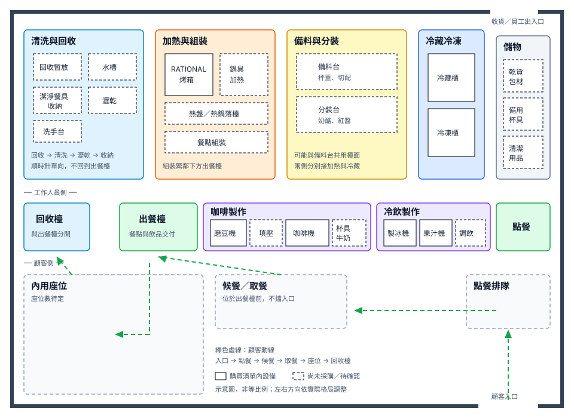
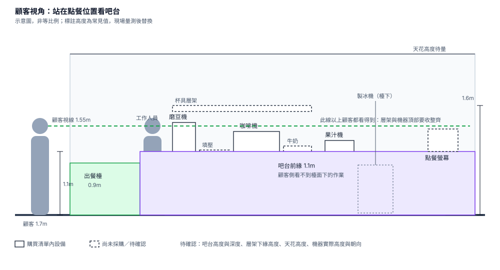
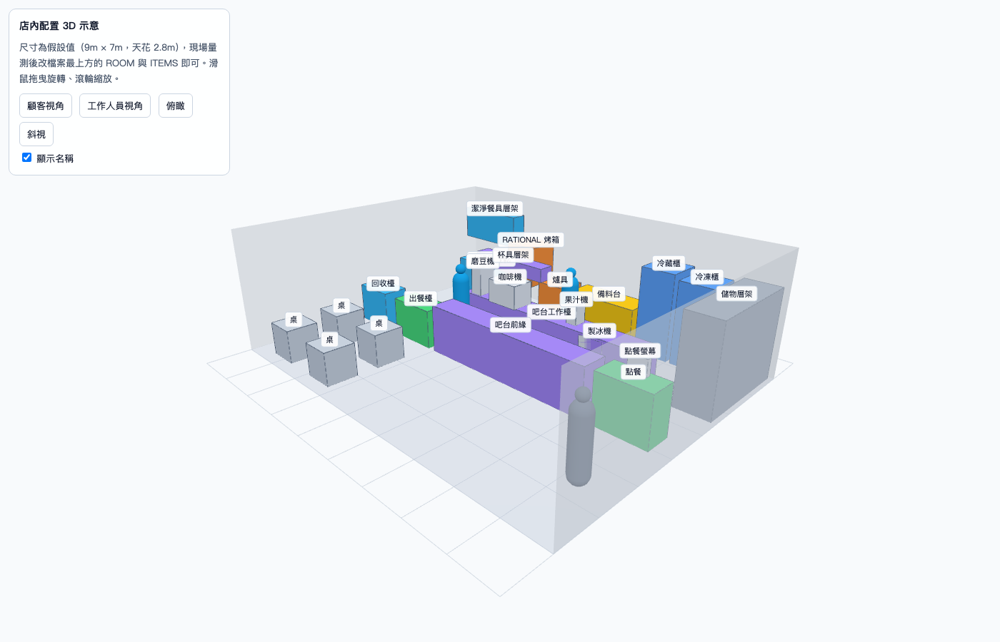
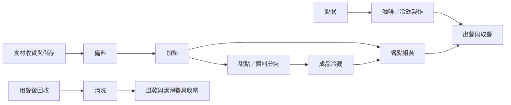

# 店內設備擺放規劃

依[設備購買清單](equipment.md)與[食譜](recipes.md)整理的分區草案。店面格局、尺寸與同時作業人數尚待確認，先規劃設備間的相鄰關係，再決定位置與尺寸。

## 分區配置

圖上看不出來、但會影響尺寸的幾點：

- 磨豆到萃取之間要留得下單手操作的檯面，杯具與牛奶取用位置在咖啡機一臂內
- 備料台與分裝台要放得下整批材料與容器，冷藏櫃、冷凍櫃同樣以整批容器計算容量
- 儲物櫃依每日用量與補貨量估算，清潔用品與乾貨、包材分開收納

## 吧台立面

平面圖決定相鄰關係，高度與視線要從顧客站的位置看才看得出來。

- 吧台前緣比工作檯高，檯面下的作業與雜物顧客看不到；出餐段刻意做低，交付時不必越過高檯
- 顧客視線約 1.55m，這條線以上的層架、機器頂部都是門面的一部分
- 製冰機等高機身設備放檯下，避免擋住工作人員與顧客之間的視線

## 3D 示意

後台「店內配置」頁（biru-admin `/store-layout`，限平台管理員）可旋轉並切換顧客、工作人員、俯瞰視角。尺寸目前是假設值 9m × 7m × 2.8m，量測後改 biru-admin 的 `constants/storeLayout.ts` 即可重算。

它能回答的是走道寬度、檯面高度、視線遮擋、設備占位這類問題；材質、燈光、裝潢效果不在範圍內，那些看[參考店家](#參考店家現場觀察)的實景。

## 工作動線

以下表示作業順序，實際左右方向依店面格局調整。

## 設備定位表

尺寸與安裝條件在型號確定後填入；設備本體以外，還要計入開門、操作、散熱與維修空間。

| 設備                         | 規劃位置               | 定位前需確認                                     |
| ---------------------------- | ---------------------- | ------------------------------------------------ |
| Victoria Arduino 咖啡機      | 咖啡工作區，磨豆機旁   | 型號、機身尺寸、檯面承重、供排水及電源條件       |
| Mahlkönig E80 Supreme 磨豆機 | 咖啡機旁，鄰接填壓位置 | 豆槽補豆高度、清潔拆卸空間、插座位置             |
| HOSHIZAKI DCM-70L 製冰機     | 冷飲工作區             | 取冰操作方向、供排水、散熱方向與維修空間         |
| 果汁機                       | 調飲檯面，靠近製冰機   | 型號、杯體取放高度、清洗路徑                     |
| RATIONAL 烤箱                | 廚房加熱區             | 型號、開門方向、熱盤落檯、供排水與排氣條件       |
| 冷藏櫃                       | 備料與分裝區旁         | 容量、開門方向；牛奶取用與成品儲存能否共用此位置 |
| 冷凍櫃                       | 食材儲存區，靠近備料台 | 型號、容量、開門方式、取料及補貨空間             |

## 尚未列入購買清單的工作位置

| 項目                 | 用途                             | 待確認                                             |
| -------------------- | -------------------------------- | -------------------------------------------------- |
| 備料台與分裝台       | 食材秤重、切配、奶酪與紅醬分裝   | 是否共用檯面、整批容器所需面積                     |
| 鍋具加熱位置         | 奶酪加熱、紅醬熬煮               | 熱源設備與鍋具規格                                 |
| 清洗、洗手與瀝乾位置 | 器具清洗、手部清潔、潔淨餐具暫放 | 既有水槽與供排水位置、是否配置洗碗設備             |
| 咖啡渣與垃圾收集     | 製作途中與收店清理               | 靠近各作業點的收集位置與清運路徑                   |
| 收納櫃／層架         | 杯盤、乾貨與包材                 | 每日用量與補貨量，對照[餐具清單](tableware.md)安排 |
| 出餐檯與回收檯       | 成品交付、髒餐具暫放             | 分開定位，確認尖峰時段暫放量                       |

## 參考店家現場觀察

店面尺寸定案前，先到[參考店家](references.md)實地看同規模店的做法。每家記一份，重點是能帶回來的數字與拍得到的關係，不是裝潢風格。

| 觀察項目           | 要記的內容                                             | 為什麼要看                                 |
| ------------------ | ------------------------------------------------------ | ------------------------------------------ |
| 吧台尺寸           | 前緣高度、檯面深度、整段長度（用磁磚或地板格數估）     | 決定顧客側視線與工作側檯面，是本文件最缺的 |
| 工作走道           | 吧台與後方檯面之間的淨寬、兩人交會時是否要側身         | 決定後場深度，也決定尖峰能站幾個人         |
| 機器排列           | 磨豆機、咖啡機、製冰機的前後左右關係與朝向             | 對照本文件的咖啡、冷飲工作區排法           |
| 出餐與回收         | 出餐位置、髒餐具回收位置、兩者距離                     | 驗證回收與出餐分開是否可行                 |
| 點餐與候餐         | 排隊動線起點、候餐站位、會不會擋住入口或座位           | 顧客動線的實測依據                         |
| 座位密度           | 桌距、走道寬、座位數與店面面積的比例                   | 估內用座位數                               |
| 檯面下與層架       | 檯下放什麼（冷藏、垃圾、杯具）、層架高度與伸手可及範圍 | 本文件尚未規劃的收納位置                   |
| 顧客看得到的後場   | 站在點餐位置能看到哪些設備與作業                       | 決定隔間高度與機器擺放的正面朝向           |
| 尖峰時段（可再訪） | 同時作業人數、卡住的位置、等待長度                     | 空店時看不出來的瓶頸                       |

記錄方式：每項拍一張照，能量的用捲尺或以地磚尺寸換算，數字回填本文件的[現場量測與定案](#現場量測與定案)與設備定位表。

## 現場量測與定案

| 資料       | 待填內容                             |
| ---------- | ------------------------------------ |
| 店面尺寸   | 室內長寬、天花高度、柱位與固定隔間   |
| 出入口     | 顧客入口、工作人員進出與收貨位置     |
| 顧客區     | 內用座位、候餐與取餐位置             |
| 工作人數   | 平常及尖峰同時作業人數               |
| 水電與排氣 | 既有插座、配電、供排水與排氣位置     |
| 設備尺寸   | 最終型號、安裝圖與廠商要求的預留空間 |

取得尺寸後，先繪製等比例平面圖，再用實際設備占位模擬咖啡、冷飲、餐點與清洗作業；確認開門、補貨及人員交會不互相阻擋後，定案設備位置與管線。
