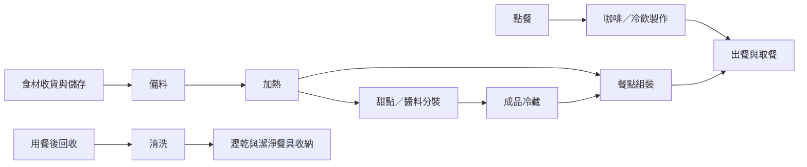

# 店內設備擺放規劃

依[設備購買清單](equipment.md)與[食譜](recipes.md)整理的分區草案。店面格局、尺寸與同時作業人數尚待確認，先規劃設備間的相鄰關係，再決定位置與尺寸。

## 分區配置

| 分區       | 設備與工作位置                         | 擺放規劃                                                           |
| ---------- | -------------------------------------- | ------------------------------------------------------------------ |
| 點餐與取餐 | 點餐位置、出餐檯、外帶包材             | 位於顧客側，點餐與取餐各留停留位置，避免擋住入口                   |
| 咖啡製作   | 磨豆機、填壓位置、咖啡機               | 相鄰排列，磨豆到萃取之間保留操作檯面；杯具與牛奶取用位置靠近咖啡機 |
| 冷飲製作   | 製冰機、果汁機、調飲檯面               | 靠近飲品出餐位置；取冰與調飲在同一工作區完成                       |
| 備料       | 備料台、秤重與切配位置                 | 接近食材冷藏、冷凍與儲物位置，保留整批材料與容器擺放空間           |
| 加熱       | 烤箱、鍋具加熱位置                     | 接近備料台與餐點出餐位置，預留熱盤、熱鍋放置檯面                   |
| 分裝與冷藏 | 分裝檯面、冷藏櫃                       | 奶酪、紅醬分裝後的存放路徑保持簡短；櫃內預留整批容器的位置         |
| 清洗與回收 | 餐具回收、清洗位置、瀝乾與潔淨餐具收納 | 回收入口與出餐檯分開，依回收、清洗、瀝乾、收納順序安排             |
| 儲物       | 乾貨、備用杯具、外帶包材、清潔用品     | 常用品靠近使用位置；清潔用品另設收納位置                           |

## 工作動線

以下表示作業順序，實際左右方向依店面格局調整。

## 設備定位表

尺寸與安裝條件在型號確定後填入；設備本體以外，還要計入開門、操作、散熱與維修空間。

| 設備                         | 規劃位置               | 定位前需確認                                     |
| ---------------------------- | ---------------------- | ------------------------------------------------ |
| Victoria Arduino 咖啡機      | 咖啡工作區，磨豆機旁   | 型號、機身尺寸、檯面承重、供排水及電源條件       |
| Mahlkönig E80 Supreme 磨豆機 | 咖啡機旁，鄰接填壓位置 | 豆槽補豆高度、清潔拆卸空間、插座位置             |
| HOSHIZAKI DCM-70L 製冰機     | 冷飲工作區             | 取冰操作方向、供排水、散熱方向與維修空間         |
| 果汁機                       | 調飲檯面，靠近製冰機   | 型號、杯體取放高度、清洗路徑                     |
| RATIONAL 烤箱                | 廚房加熱區             | 型號、開門方向、熱盤落檯、供排水與排氣條件       |
| 冷藏櫃                       | 備料與分裝區旁         | 容量、開門方向；牛奶取用與成品儲存能否共用此位置 |
| 冷凍櫃                       | 食材儲存區，靠近備料台 | 型號、容量、開門方式、取料及補貨空間             |

## 尚未列入購買清單的工作位置

| 項目                 | 用途                             | 待確認                                             |
| -------------------- | -------------------------------- | -------------------------------------------------- |
| 備料台與分裝台       | 食材秤重、切配、奶酪與紅醬分裝   | 是否共用檯面、整批容器所需面積                     |
| 鍋具加熱位置         | 奶酪加熱、紅醬熬煮               | 熱源設備與鍋具規格                                 |
| 清洗、洗手與瀝乾位置 | 器具清洗、手部清潔、潔淨餐具暫放 | 既有水槽與供排水位置、是否配置洗碗設備             |
| 咖啡渣與垃圾收集     | 製作途中與收店清理               | 靠近各作業點的收集位置與清運路徑                   |
| 收納櫃／層架         | 杯盤、乾貨與包材                 | 每日用量與補貨量，對照[餐具清單](tableware.md)安排 |
| 出餐檯與回收檯       | 成品交付、髒餐具暫放             | 分開定位，確認尖峰時段暫放量                       |

## 現場量測與定案

| 資料       | 待填內容                             |
| ---------- | ------------------------------------ |
| 店面尺寸   | 室內長寬、天花高度、柱位與固定隔間   |
| 出入口     | 顧客入口、工作人員進出與收貨位置     |
| 顧客區     | 內用座位、候餐與取餐位置             |
| 工作人數   | 平常及尖峰同時作業人數               |
| 水電與排氣 | 既有插座、配電、供排水與排氣位置     |
| 設備尺寸   | 最終型號、安裝圖與廠商要求的預留空間 |

取得尺寸後，先繪製等比例平面圖，再用實際設備占位模擬咖啡、冷飲、餐點與清洗作業；確認開門、補貨及人員交會不互相阻擋後，定案設備位置與管線。
